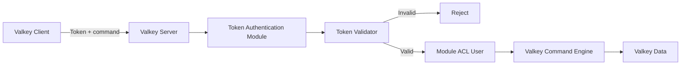
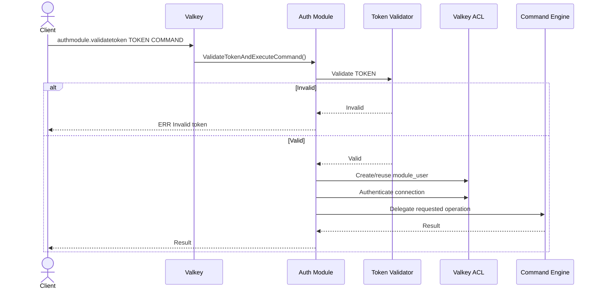
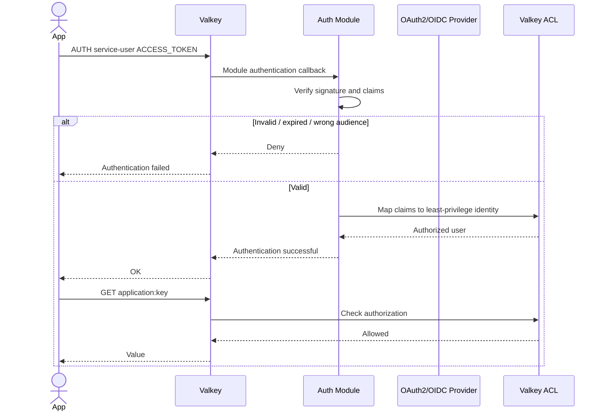
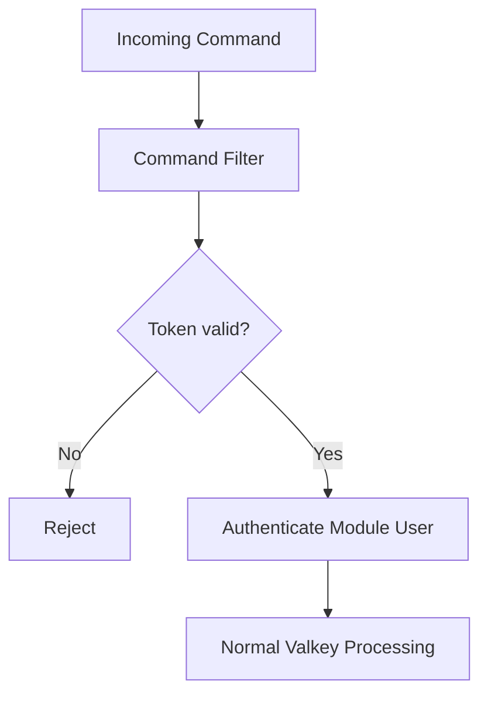
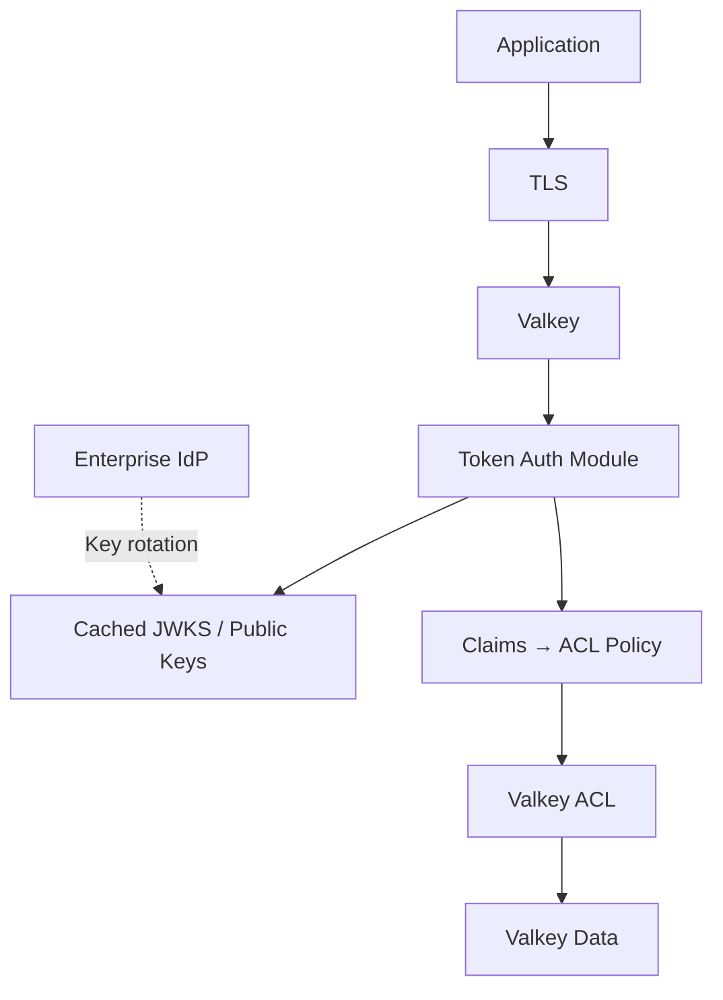
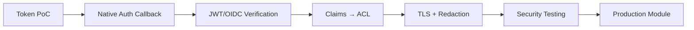

# Valkey Token Authentication
Reference: https://github.com/valkey-io/valkey/issues/2104
[](https://valkey.io/)
[](#)
[](#production-readiness)

A proof-of-concept **Valkey server-side authentication module written in C** that explores token-based authentication and authorization at the data-platform layer.

The repository demonstrates two approaches:

1. A custom `authmodule.validatetoken` command that validates a token and authenticates the connection as a module-defined ACL user.
2. A command-filter experiment that intercepts commands and explores token validation before command execution.

> [!IMPORTANT]
> The current validator uses a fixed demonstration token and the module-defined user receives broad permissions. Replace both before using this code outside local development.

## Architecture



## Repository Structure

```text
Valkey-token-authentication/
├── validatetoken.c
├── validatetokenusingcommandfilter.c
├── testvalidatetoken.c
└── .idea/
```

`validatetoken.c` is the primary proof of concept. It registers `authmodule.validatetoken`, validates a supplied token, creates/reuses a module ACL user, authenticates the connection, and attempts to delegate command execution.

`validatetokenusingcommandfilter.c` explores a second design using a global Valkey command filter.

`testvalidatetoken.c` is an earlier user/password-management experiment using a different API shape and should be treated as exploratory code rather than the primary build path.

## Token Authentication Flow



The current `isTokenValid()` implementation performs a simple comparison with a fixed demonstration token. It is the natural extension point for real JWT/OAuth2/OIDC verification.

## Authentication and Authorization

The prototype creates a module-defined user named `module_user` and currently enables broad command/key access.

The intended architecture is:

```text
External identity token
        ↓
Token validation
        ↓
Identity / claims
        ↓
Valkey ACL mapping
        ↓
Authenticated connection
        ↓
Authorized command
```

Authentication determines **who the caller is**. Valkey ACL rules should determine **what the caller can do**.

## Recommended Production Authentication

Modern Valkey exposes `ValkeyModule_RegisterAuthCallback()` specifically for module-based authentication. A production version should prefer that API over using a global command filter for authentication.



For JWTs, prefer local cryptographic verification using cached identity-provider public keys instead of making a blocking network request for every authentication.

## Build

### Prerequisites

- Valkey and a compatible `valkeymodule.h`
- GCC or Clang
- Linux/macOS development environment
- `make` recommended

A typical shared-library build is:

```bash
gcc -fPIC -shared -o validatetoken.so validatetoken.c
```

If the Valkey header is elsewhere:

```bash
gcc -Wall -Wextra -fPIC -shared   -I/path/to/valkey/src   -o validatetoken.so   validatetoken.c
```

Compiler/API compatibility depends on the `valkeymodule.h` version being used.

## Load and Run

Add the module to `valkey.conf`:

```text
loadmodule /absolute/path/to/validatetoken.so
```

Start Valkey:

```bash
valkey-server /path/to/valkey.conf
```

Verify:

```bash
valkey-cli MODULE LIST
```

For development environments that permit runtime module loading:

```bash
valkey-cli MODULE LOAD /absolute/path/to/validatetoken.so
```

Then connect:

```bash
valkey-cli
```

The proof-of-concept command shape is:

```text
authmodule.validatetoken <token> <command> [arguments...]
```

Do not use the repository's fixed demonstration token as a real credential.

## Command Filter Experiment

The alternative source registers `ValkeyModule_RegisterCommandFilter()`.



Command filters execute before command processing and affect a very broad execution surface. Valkey's dedicated authentication callback API is a better semantic fit for production authentication.

## Security Considerations

### Replace fixed token validation

Production JWT/OIDC validation should verify:

```text
Cryptographic signature
Issuer (iss)
Audience (aud)
Expiration (exp)
Not-before (nbf), when applicable
Required scopes / roles
Token type
```

Never trust decoded claims before signature verification.

### Apply least privilege

Do not map every valid token to `allcommands` and `allkeys`.

Example policy:

```text
cache.reader
    +GET +MGET
    ~application:*

cache.writer
    +GET +SET +DEL
    ~application:*
```

### Use TLS

Bearer tokens are credentials. Encrypt client/server communication so tokens cannot be observed in transit.

### Never log tokens

Tokens should not appear in application logs, Valkey logs, tracing, `SLOWLOG`, `MONITOR`, error messages, or audit payloads. Use Valkey's argument-redaction capabilities for sensitive command arguments.

### Fail closed

If validation cannot establish that a token is valid, deny authentication.

```text
VALID   → allow according to ACL
INVALID → deny
UNKNOWN → deny
```

### Avoid blocking the server thread

Do not synchronously call a remote identity provider from Valkey's main execution path. Prefer locally verified JWTs with cached JWKS/public keys, or use Valkey's blocking-auth facilities when asynchronous validation is unavoidable.

### Protect the native-code boundary

This module runs inside the Valkey server process. A memory-safety defect can affect the entire server.

Use:

```text
-Wall -Wextra
AddressSanitizer
UndefinedBehaviorSanitizer
static analysis
fuzz testing
bounds checking
careful memory ownership
```

## Security Architecture



The central design principle is:

> **The identity provider establishes identity; Valkey ACLs enforce data-plane authorization.**

## Testing

A production implementation should automate at least these cases:

| Scenario | Expected Result |
|---|---|
| Missing token | Reject |
| Invalid token | Reject |
| Expired token | Reject |
| Wrong issuer | Reject |
| Wrong audience | Reject |
| Valid token | Authenticate |
| Valid token + unauthorized command | ACL denies |
| Valid token + unauthorized key | ACL denies |
| Valid token + permitted command/key | Succeeds |
| Token in logs/monitoring | Redacted |

## Production Readiness

The current repository is best classified as a **proof of concept / security architecture experiment**.

Before production use, add real JWT/OIDC verification, `ValkeyModule_RegisterAuthCallback()`, least-privilege claim-to-ACL mapping, TLS, token redaction, audit logging, unit/integration tests, fuzz testing, CI security scanning, and operational metrics.

## Suggested Project Structure

```text
Valkey-token-authentication/
├── src/
│   ├── auth_module.c
│   ├── token_validator.c
│   ├── token_validator.h
│   ├── acl_mapper.c
│   └── acl_mapper.h
├── tests/
│   ├── test_token_validator.c
│   ├── test_acl_mapper.c
│   └── integration/
├── examples/
│   └── valkey.conf
├── Makefile
├── Dockerfile
├── .github/workflows/build-test.yml
├── LICENSE
└── README.md
```

## Roadmap



## References

This project uses the Valkey Modules API. The most relevant official documentation is the Valkey Modules Introduction, Modules API Reference, AUTH/ACL documentation, and Valkey security guidance.

## Disclaimer

This repository is intended for experimentation, learning, and architecture prototyping. Do not use the current fixed-token validation or unrestricted module ACL user in production.
